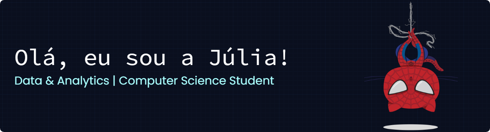

  <!-- Header Banner -->
  

    

  <!-- Apresentação Principal -->
  <h1>❤️ hey! i'm Júlia. welcome to my page! ✨</h1>

---

### 💼 Perfil

> 💻 **Formação:** Estudante de Ciência da Computação (FECAP)  
> 📊 **Foco:** Área de dados e análise  
> ⚡ **Mente:** Movida a curiosidade e bons desafios  

---

### 🚀 Tecnologias & Ferramentas

#### 🗄️ Bancos de Dados

 

#### 💻 Linguagens *(aprendendo ou já tive contato)*

 

#### ⚙️ Ambientes & Ferramentas

---

### 📬 Contato

| **LinkedIn** | **E-mail** |
| :---: | :---: |
| 💼 [júlia-godinho](https://www.linkedin.com/in/júlia-godinho-936a95215) | ✉️ [juliapgodinho11@gmail.com](mailto:juliapgodinho11@gmail.com) |

 

*Fique à vontade para me mandar uma mensagem ou trocar uma ideia! 🚀*

